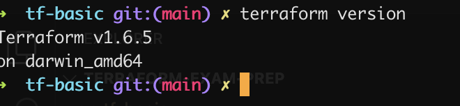
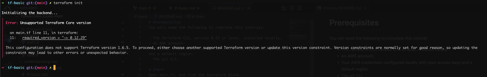
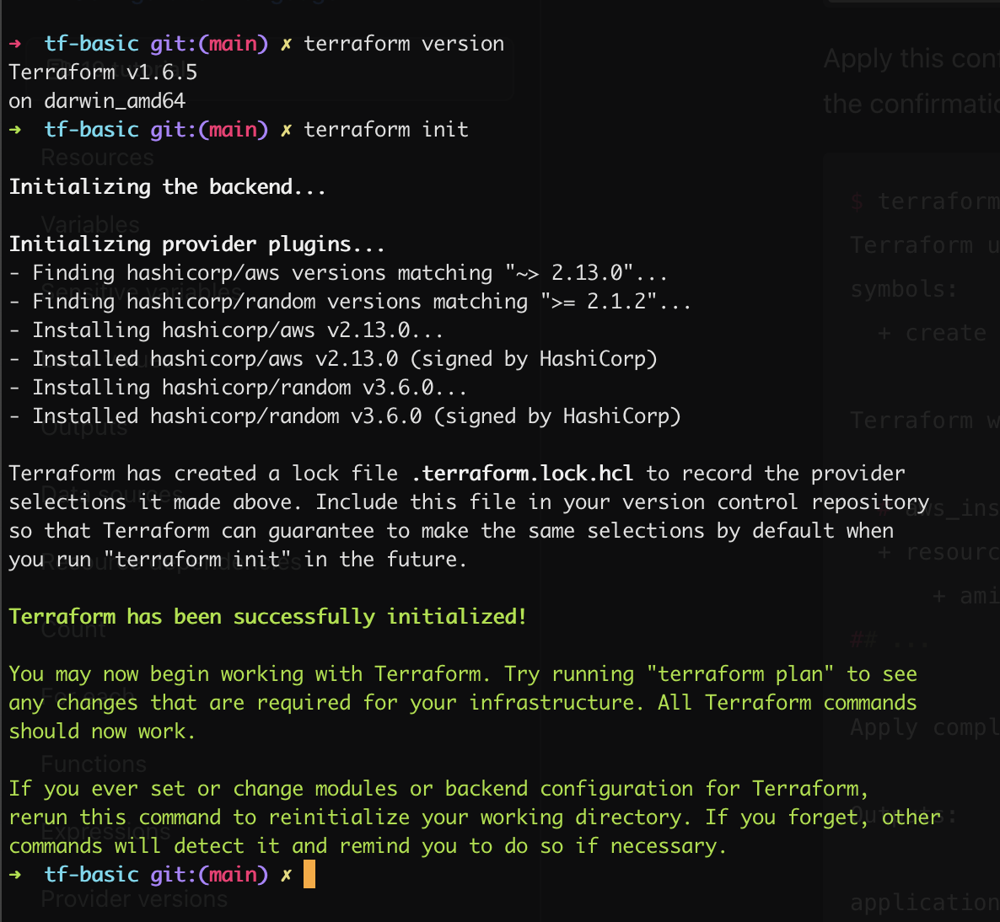

# Prerequisites
You will need the following to complete this tutorial:

- The Terraform CLI, version 0.15 or later, installed locally.
- An AWS account.
- Your AWS credentials configured locally with your access keys and a default region.
- The git CLI.

# Start - TF versioning
Open main.tf, and find the terraform block.
```
terraform {
  required_providers {
    aws = {
      version = "~> 2.13.0"
    }
    random = {
      version = ">= 2.1.2"
    }
  }

  required_version = "~> 0.12.29"
}
```

- This configuration sets required_version to ~> 0.12.29. The ~> symbol allows the patch version to be greater than 29 but requires the major and minor versions (0.12) to match the version that the configuration specifies. 
- Terraform will error if you attempt to use this configuration with a more recent version than 0.12.x, because of this required_version setting.


Use the version subcommand to check your Terraform version and the version of any providers your configuration is using.



Attempt to initialize your project with terraform init. Terraform will print out an error telling you that your local version of Terraform is too new for this configuration's required_version constraint.



- HashiCorp uses the format major.minor.patch for Terraform versions. HashiCorp updates Terraform frequently, so it is common to use configuration written for an earlier version of Terraform.
- New minor and patch versions of Terraform are backward compatible with configuration written for previous versions. Because of this, you can upgrade to a newer minor version of Terraform and still use your existing configurations.
- However, upgrading your Terraform version can have other consequences, such as requiring you to update your provider versions.
- Some version updates may refresh your state file version or require configuration file edits to implement new features. 
- Use the required_version setting to control which versions of Terraform will work with your configurations to ensure that updates to your infrastructure are safe and predictable.

In main.tf, replace 0.12.29 with your current Terraform version, as printed out by the terraform version command. Be sure to save the file.



The following table summarizes some of the ways you can pin the Terraform version in the required_version setting, assuming Terraform v0.15.0 as your current target version. Refer to the Terraform documentation for a detailed explanation of version constraints.

| Required Version | Meaning                                            | Considerations                                                |
|------------------|----------------------------------------------------|---------------------------------------------------------------|
| 0.15.0           | Only Terraform v0.15.0 exactly                     | To upgrade Terraform, first edit the required_version setting |
| >= 0.15          | Any Terraform v0.15.0 or greater                   | Includes Terraform v1.0.0 and above                           |
| ~> 0.15.0        | Any Terraform v0.15.x, but not v1.0 or later       | Minor version updates are intended to be non-disruptive       |
| >= 0.15, < 2.0.0 | Terraform v0.15.0 or greater, but less than v2.0.0 | Avoids major version updates                                  |


# Start - TF State